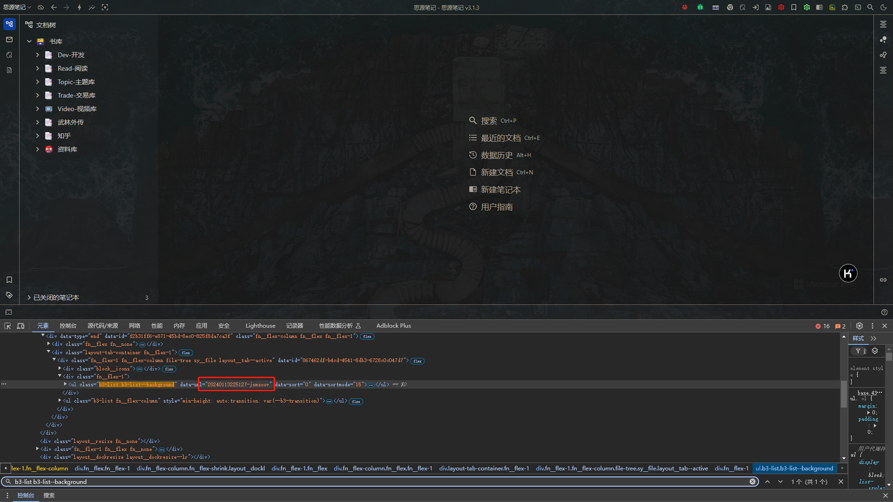

# 思源笔记：视频笔记插件

#### 1、下载最新Releases版本

#### 2、解压

- 找到`视频笔记模版.sy.zip`​文件，导入思源

- 把导入的文件`视频笔记模版`导出为模版

- 在思源的数据目录中找到`视频笔记模版.md`文件，拿到完整路径,替换`common.js`中`pageTemplateUrl`字段
​​

- 打开思源笔记`设置-关于`菜单，找到`API token`，替换`common.js`中`Authorization`字段
​​

- 打开思源笔记网页端，只打开一个笔记本，`F12`打开开发者工具，`元素`菜单中搜索`b3-list b3-list--background`，边上`data-url`里的值替换`common.js`中`notebook`字段
  

#### 3、进入Chrome扩展页面,加载插件文件夹并开启插件

#### 4、演示

- [B站](https://www.bilibili.com/video/BV1rdYfeLE87/)
- [百度网盘](https://www.bilibili.com/video/BV19QYqeBEgi)

#### 5、备注

- 本插件只适用于思源web端
- 目前支持B站、百度网盘、youtube视频数据的同步,需要支持其他站点的可以开issue提需求，或者自行二次开发
- 本插件开发主要是为自用，做不到充分的测试覆盖，如果使用出现任何异常请直接CTRL+F5强刷页面，基本可以100%解决问题，如果还是不行请开issue反馈
- 下载按钮因为网站前端各自缓存机制以及拦截机制的原因，可能会导致下载到之前的数据或者下载按钮无法显示，刷新页面或者切换分P即可
- 插件会持续优化，直到我觉得够用为止
