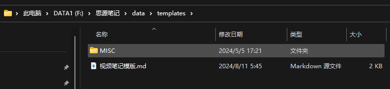
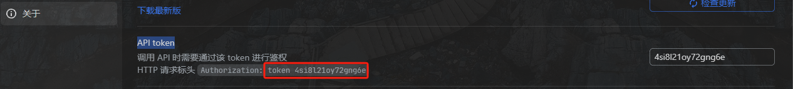
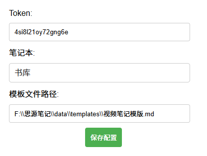

# 思源笔记：视频笔记插件

##### 1、下载最新Releases版本 或者 Chrome商店搜索`思源笔记：视频笔记插件`直接安装

##### 2、Releases版本安装模式解压安装包，进入Chrome扩展页面，加载插件文件夹并开启插件，商店安装模式可以跳过这一步

##### 3、导入视频笔记模版 && 配置插件参数

- 找到`视频笔记模版.sy.zip`​文件，导入思源

- 把导入的文件`视频笔记模版`导出为模版

- 点击插件图标按钮，进入插件参数配置页面

- 在思源的数据目录中找到`视频笔记模版.md`文件，拿到完整路径，填入配置页模板文件路径输入框中
​​

- 打开思源笔记`设置-关于`菜单，找到`API token`，填入配置页Token输入框中
​​

- 配置页中选择一个数据同步的笔记本

- 点击保存配置，完成配置

##### 4、演示

- [B站](https://www.bilibili.com/video/BV1rdYfeLE87/)
- [百度网盘](https://www.bilibili.com/video/BV19QYqeBEgi)

##### 5、备注

- 本插件只适用于思源web端
- 目前支持B站、百度网盘、Youtube视频数据的同步,需要支持其他站点的可以开issue提需求，或者自行二次开发
- 本插件开发主要是为自用，做不到充分的测试覆盖，如果使用出现任何异常请直接CTRL+F5强刷页面，基本可以解决大部分异常情况，如果还是不行请开issue反馈
- 下载按钮不正常显示，是因为网站前端缓存机制不触发请求的原因，本插件是通过劫持请求获取数据，如果出现不显示的情况，只需要强刷页面或者切换分P即可
