# B站视频插件

## 1、下载[插件](https://github.com/coriger/siyuan-video-extension/archive/refs/heads/master.zip)

## 2、解压插件ZIP包到本地，找到`视频笔记模版.sy.zip`​文件

​​​

### 导入思源

​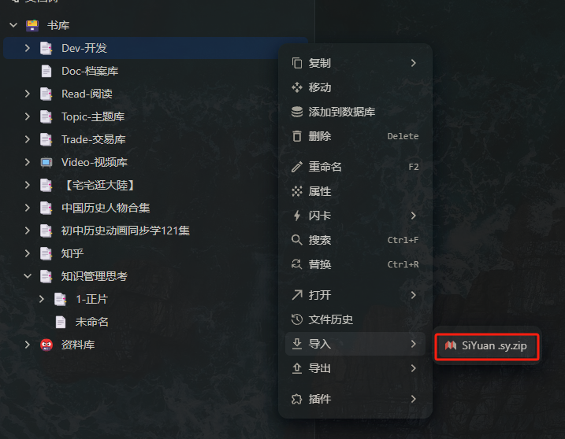​

### 把文件再导出成模版

​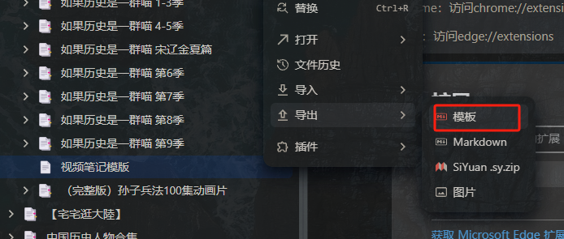​

### 到思源的数据目录中找到这个md文件

​​

### 从插件文件夹中找到content.js文件，找到下图字段替换成自己本地模版所在路径

​​

### 思源设置-关于找到API token，替换content.js中下图字段

​​

​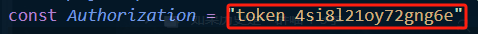​

## 3、使用Chrome或者Edge进入扩展页面

> Chrome：访问chrome://extensions
>
> Edge：访问edge://extensions

## 4、加载之前下载的扩展目录，选择插件的根目录并开启插件

​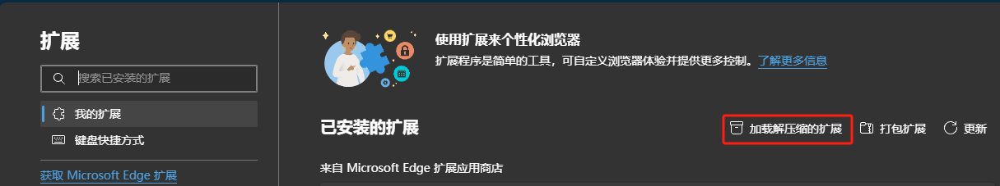​

​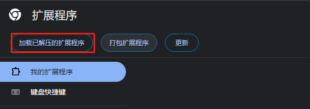​

​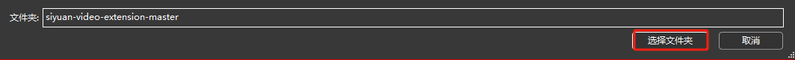​

​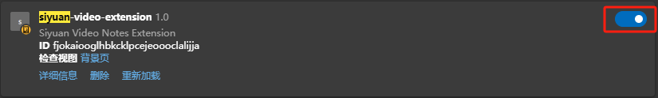​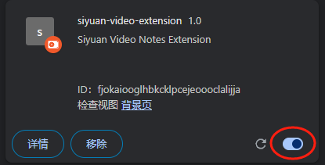​

## 5、目前支持B站bilibili.com/video，bilibili.com/bangumi/play路径页面的视频数据同步，主要是四类

### 单个视频，右上角会出现下载单视频按钮，如果没有，可以Ctrl+F5强刷一下

​​

### 选集，等页面选集数据加载出来后，右上角会出现相应下载选集按钮，如果没有，可以强刷页面，或者切换选集中的视频

​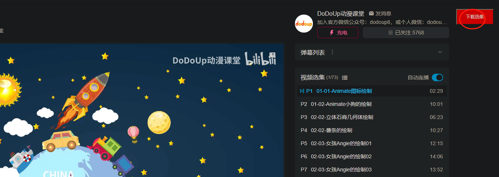​

‍

### 合集，等页面合集数据加载出来后，右上角会出现相应下载合集按钮，如果没有，可以强刷页面，或者切换选集中的视频

​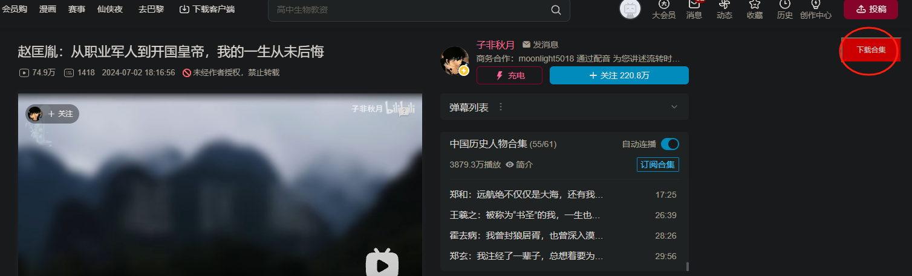​

### 正片这块如果按钮上的字和当前页标题不一致，可以强刷

​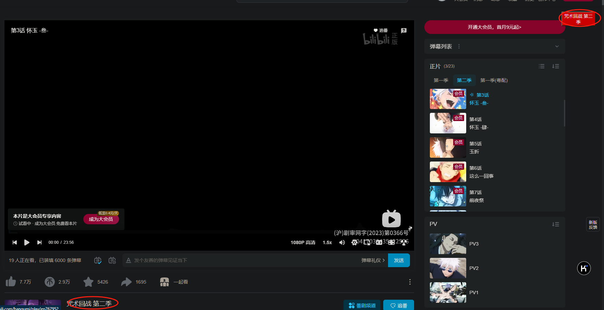​

## 6、点击下载按钮后，会先按照层级结构依次创建文档，然后根据模版样式进行渲染，需要一定时间，目前没有开发下载完成的页面通知，可以打开浏览器F12看控制台content.js，持续3s以上没有新的日志打印就说明下载结束了，下载途中不要去打开视频文档

​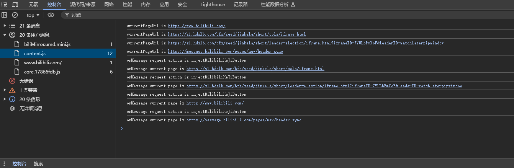​

## 7、效果图

### 合集

​​

### 选集

​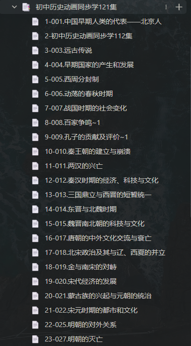​

### 正片

​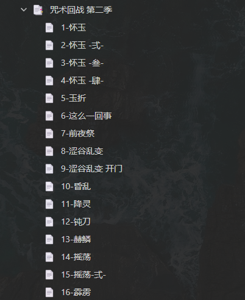​

### 视频文档，右上角三个按钮，依次是插入时间戳、视频位置重置、截图

‍

## 8、最重要一点：使用web端访问思源才能正常使用
